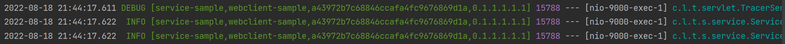

[](https://github.com/lzhpo/logging-tracer-spring-boot-starter/actions/workflows/style-check.yml)
[](https://www.codacy.com?utm_source=github.com&amp;utm_medium=referral&amp;utm_content=lzhpo/logging-tracer-spring-boot-starter&amp;utm_campaign=Badge_Grade)

## 开源地址

- GitHub：[https://github.com/lzhpo/logging-tracer](https://github.com/lzhpo/logging-tracer)
- Gitee：[https://gitee.com/lzhpo/logging-tracer](https://gitee.com/lzhpo/logging-tracer)

## 前言

> 当我们使用Splunk、ELK等日志工具的时候，我们希望有一个`traceId`就可以把这个请求关联的所有服务日志都搜索出来，并且可以看到上下游服务名称，以及当前请求经历了几层服务，这样子更加方便我们定位问题。

日志样例：



```shell
2022-12-04 17:24:33.015 DEBUG [service-sample,reactor-netty-sample,3a13f40b0ac24c0bb6b981ffde658ff6,0.1.1.1.1.1.1] 22456 --- [nio-9000-exec-1] c.l.t.servlet.TracerServletInterceptor   : Built logging tracer context: {X-B3-TraceId=3a13f40b0ac24c0bb6b981ffde658ff6, X-B3-SpanName=service-sample, X-B3-SpanId=0.1.1.1.1.1.1, X-B3-Parent-SpanName=reactor-netty-sample}
2022-12-04 17:24:33.028  INFO [service-sample,reactor-netty-sample,3a13f40b0ac24c0bb6b981ffde658ff6,0.1.1.1.1.1.1] 22456 --- [nio-9000-exec-1] c.l.t.s.service.ServiceSampleController  : Received new request for hello api.
2022-12-04 17:24:33.028  INFO [service-sample,reactor-netty-sample,3a13f40b0ac24c0bb6b981ffde658ff6,0.1.1.1.1.1.1] 22456 --- [nio-9000-exec-1] c.l.t.s.service.ServiceSampleController  : Request header with [user-agent: ReactorNetty/1.0.25]
```

`[service-sample,webclient-sample,3a13f40b0ac24c0bb6b981ffde658ff6,0.1.1.1.1.1]`：

- `service-sample`：当前服务名称。
- `webclient-sample`：上游服务名称。
- `3a13f40b0ac24c0bb6b981ffde658ff6`：链路ID，即traceId。
- `0.1.1.1.1.1.1`：请求经历的服务层级。
  - 假设是0：表示到达当前位置，没有经历下游服务。
  - 假设是0.1：表示到达当前位置，已经经历了1层下游服务。
  - 假设是0.1.1：表示到达当前位置，已经经历了2层下游服务。
  - 以此类推...

## 快速使用

*logging-tracer-spring-boot-starter也支持SpringBoot3*

> 3.0.0及以上版本的logging-tracer-spring-boot-starter只针对使用SpringBoot3用户，SpringBoot2用户请使用低于3.0.0版本的logging-tracer-spring-boot-starter，两者功能不受影响，均会同步更新！

### 导入依赖

> 依赖已发布至Maven中央仓库，可直接引入依赖。

- Maven：
  ```xml
  <dependency>
    <groupId>com.lzhpo</groupId>
    <artifactId>logging-tracer-spring-boot-starter</artifactId>
    <version>${latest-version}</version>
  </dependency>
  ```
- Gradle:
  ```groovy
  implementation 'com.lzhpo:logging-tracer-spring-boot-starter:${latest-version}'
  ```

_PS：如果不需要定制，直接导入相关依赖按照下面组件说明正常使用即可。_

### 使用示例

在这模拟多链路调用服务，按如下顺序逐层call：

| 顺序 |       服务名称       |                     截取的部分trace样例                      |
| :--: | :------------------: | :----------------------------------------------------------: |
|  1   |     feign-sample     |   `[feign-sample,N/A,3a13f40b0ac24c0bb6b981ffde658ff6,0]`    |
|  2   |  httpclient-sample   | `[httpclient-sample,feign-sample,3a13f40b0ac24c0bb6b981ffde658ff6,0.1]` |
|  3   |    okhttp-sample     | `[okhttp-sample,httpclient-sample,3a13f40b0ac24c0bb6b981ffde658ff6,0.1.1]` |
|  4   | resttemplate-sample  | `[resttemplate-sample,okhttp-sample,3a13f40b0ac24c0bb6b981ffde658ff6,0.1.1.1]` |
|  5   |   webclient-sample   | `[webclient-sample,okhttp-sample,3a13f40b0ac24c0bb6b981ffde658ff6,0.1.1.1.1]` |
|  6   | reactor-netty-sample | `[reactor-netty-sample,webclient-sample,3a13f40b0ac24c0bb6b981ffde658ff6,0.1.1.1.1.1]` |
|  7   |    service-sample    | `[service-sample,reactor-netty-sample,3a13f40b0ac24c0bb6b981ffde658ff6,0.1.1.1.1.1.1]` |

#### 1.Feign

导入feign依赖将自动生效。

```xml
<dependency>
    <groupId>org.springframework.cloud</groupId>
    <artifactId>spring-cloud-starter-openfeign</artifactId>
</dependency>
```

**参考示例**：logging-tracer-feign-sample

#### 2.HttpClient

导入httpclient依赖将自动生效。

```xml
<dependency>
    <groupId>org.apache.httpcomponents.client5</groupId>
    <artifactId>httpclient5</artifactId>
    <version>${httpclient.version}</version>
</dependency>
```

和使用`HttpClients`一样，不同的是在这使用的`TracerHttpClients` 的Bean，方法和`HttpClients`一样。

**参考示例**：logging-tracer-httpclient-sample

#### 3.Okhttp

导入okhttp依赖将自动生效。

```xml
<dependency>
    <groupId>com.squareup.okhttp3</groupId>
    <artifactId>okhttp</artifactId>
    <version>${okhttp.version}</version>
</dependency>
```

- **之前**：

  ```java
  OkHttpClient okHttpClient = new OkHttpClient();
  ```

- **现在**：注入`OkHttpClient.Builder`Bean直接使用，就不是直接new了。

  ```java
  @Autowired
  private OkHttpClient.Builder okHttpClientBuilder;
  
  // 略...
  OkHttpClient okHttpClient = okHttpClientBuilder.build();
  ```

**参考示例**：logging-tracer-okhttp-sample

#### 4.RestTemplate

直接注入`RestTemplate`Bean使用即可。

**参考示例**：logging-tracer-resttemplate-sample

#### 5.Webclient

直接注入`Webclient`Bean使用即可。

**参考示例**：logging-tracer-webclient-sample

#### 6.Reactor-Netty

直接注入`HttpClient`Bean使用即可。

**参考示例**：logging-tracer-reactor-netty-sample

#### 7.SpringCloud-Gateway

加入了`logging-tracer-spring-boot-starter`依赖即可，在SpringCloud-Gateway环境中会自动生效。

#### 8.Dubbo

导入dubbo依赖将自动生效。

**参考示例**：logging-tracer-dubbo-api-sample、logging-tracer-dubbo-consumer-sample、logging-tracer-dubbo-provider-sample

## 自定义配置

### 自定义配置文件

#### 自定义日志链路输出格式

```yaml
logging:
  tracer:
    pattern: '%5p [${spring.application.name:},%X{X-B3-Parent-SpanName},%X{X-B3-TraceId},%X{X-B3-SpanId}]'
```

当然，你也可以按照以前的方式配置，也是一样生效的，如果两个都配置了，优先使用上面的。

```yaml
logging:
  pattern:
    level: '%5p [${spring.application.name:},%X{X-B3-Parent-SpanName},%X{X-B3-TraceId},%X{X-B3-SpanId}]'
```

#### 自定义转发到下游服务的请求头

```yaml
logging:
  tracer:
    proxy-headers:
      - Authorization
      - User-Id
```

然后，这些请求头将会自动转发到下游服务，比如，我需要在日志中只显示一个`User-Id`，就可以这样配置：
```yaml
logging:
  pattern:
    level: '%5p [%X{User-Id}]'
```

_如果是多个，英文逗号分隔即可。_

#### 关闭`logging-tracer`功能

```yaml
logging:
  tracer:
    enabled: false
```

#### 多线程环境下使用

> 可以参考`logging-tracer-resttemplate-sample`模块中的`RestTemplateSampleController`中示例代码。

1. `ThreadPoolTaskExecutor`【推荐】：如果是注入`ThreadPoolTaskExecutor`线程池执行多线程任务的话，则正常使用即可，`logging-tracer`会自动处理相关逻辑。
   
   ```java
   @Autowired
   private ThreadPoolTaskExecutor threadPoolTaskExecutor;
   
   // 略...
   threadPoolTaskExecutor.execute(() -> log.info("[threadPool] Hello, I'm threadPool."));
   ```
2. `Thread`: 因为`logging-tracer`依赖的是`MDC`，所以，如果是使用的`Thread`，需要手动在子父线程中维持MDC相关上下文。
   
   ```java
    Map<String, String> context = MDC.getCopyOfContextMap();
    Thread thread = new Thread(() -> {
      MDC.setContextMap(context);
      log.info("[multiThread] Hello, I'm multiThread.");
    });
    thread.start();
   ```
3. 其它的方式也同理。

### 自定义业务逻辑

实现接口`TracerContextCustomizer`，加入到Spring容器中即可。

比如，当你需要添加请求头转发到下游服务的时候，又或者是你需要自定义日志链路输出格式，如果请求头中或当前context中没有此变量，就需要将相关的变量添加到context中。

```java
@Component
public class SampleTracerContextCustomizer implements TracerContextCustomizer {

  @Override
  public void customize(Map<String, String> context) {
    context.put("abc", "123");
    context.put("def", "456");
  }
}
```

## 鸣谢

感谢Jetbrains提供的License！


## 公众号

|         微信          |            公众号             |
|:-------------------:|:--------------------------:|
|  |  |


